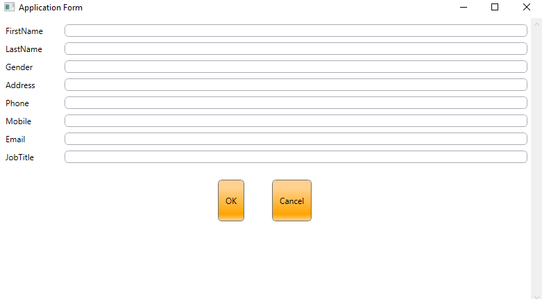
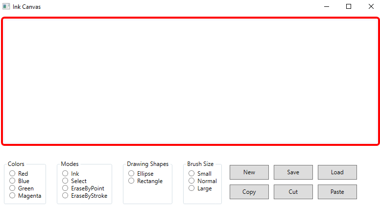
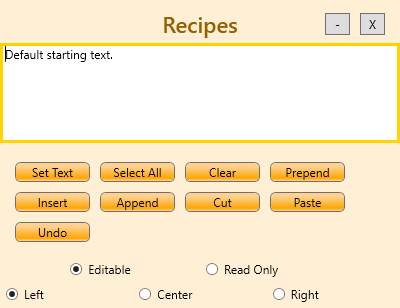

# Windows_Presentation_Foundation

C-sharp windows applications using  windows presentation foundation (WPF)

Task 1 ==> simple Form with multi inputs that prompt the inputed vales in message box

Task 2 ==> ink canvas to draw with it with color, brushes, fonts options

Task 3 ==> simple application to try different functions

